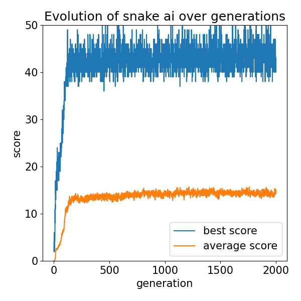

# snake_evolution
Play the classic snake game, or let the snake game play itself. Let an AI control the snake using a neural net, and train it using a genetic algorithm. Visualize how the ai-controlled snake behaves by itself.


## Table of Contents

- [Introduction](#introduction)
- [Features](#features)
- [Requirements](#requirements)
- [Installation](#installation)
- [Usage](#usage)
- [Genetic Algorithm](#genetic-algorithm)
- [Results and Conclusion](#results-and-conclusion)
- [Contributing](#contributing)
- [License](#license)


## Introduction


The classic arcade snake game allows players to control a snake and make it grow as it eats food. The snake can move around in a square grid, and grows by one block each time it eats food. The score players recieve is the total amount of food eaten.

In this project, this simple game is remade using python. On top of that, a neural network is created which can control the snake by itself, and a genetic algorithm is written that can train this neural network to become better and better over time.


## Features

- Classic Snake game implementation.
- AI-controlled snake powered by a neural network.
- Genetic algorithm to optimize the AI's behavior.
- Fitness evaluation based on score (and other factors such as survival time can also be added easily).
- Customizable design parameters for the neural network, genetic algorithm and snake game itself.
- Save and analyze results from the optimization process. 
- Visualize results such as training progress graphs and videos of AI game-play behaviour.


## Installation

1. Clone the repository:
   ```shell
   git clone https://github.com/dborstlap/snake-genetic-algorithm.git
   ```

2. Navigate to the project directory:
   ```shell
   cd snake_evolution
   ```

3. Install the required dependencies:
   ```shell
   pip install -r requirements.txt
   ```


## Usage

To run the genetic algorithm, save the data and visualize the results, run the main script.
   ```shell
   python main.py
   ```

If you just want to play the snake game manually, run snake_game.py and make sure to set the control variable correctly (key_control=True).
   ```shell
   python snake_game.py
   ```

Follow the on-screen instructions to play or observe the AI-controlled snake. Use the arrow keys to control the snake manually when playing.


## Genetic Algorithm

The genetic algorithm is a key component of this project, driving the optimization of the AI-controlled snake's behavior. It works in different steps, as explained below.

1. Initialization: The algorithm starts by generating an initial population of AI-controlled snakes with random neural network parameters.

2. Evaluation: Each snake in the population plays the Snake game, and is given a fitness score based on performance. This performance is a function of game score (apples eaten) and possibly also other factors such as survival time.

3. Selection: The snakes are sorted based on earned fitness score, and the best certain percentage of snakes is selected as parents for the next generation.

4. Crossover: The selected parent snakes undergo a crossover, which means that their genes (neural network parameters) are combined randomly to create new offspring snakes.

5. Mutation: To introduce genetic diversity and avoid getting stuck in local optima, the offspring snakes undergo random mutations in their neural network parameters.

6. Next Generation: The new offspring snakes are taken as new 'child' population.

7. Repeat: Steps 2 to 6 are repeated for a specified number of generations with the goal of systematically improving the average and maximum fitness score of the population.


## Code structure

### main.py
This is the main run-file. It has functionality to start the generic algorithm training process, or to simply play a snake game manually based on set variables. Also some hyperparameters can be defined here, which will influence the game-play or optimization process.

### snake_game.py
The game is defined here. It is made of three function classes:
SnakeGame is a class defining game mechanics.
Snake is a snake object that can play the game.
Food is a object that represents food in the map.
This file also contains some control functions, allowing for choosing manual gameplay using keys, automatic gameplay (hardcoded algorithms) and ai-controlled game-play.

### genetic_algorithm.py
Defines all functions needed to create a functioning genetic algorithm

### neural_net.py
Defines a neural network function which is basically the automatic controller of a snake game. The hyperparameters of the neural netork can be defined here. The neural network gets some state variables such as relative food position as input, and gives a movement direction as output.

### run_simulation
This file takes snake genes (neural-network parameters), and runs a simulation based on these inputs. These neural network parameters can be self-defined (if you randomly choose some numbers yourself, the snake will likely not perform well), or you can take the best results from the last training iteration by reading from a file.

### save_data.py
Contains some help functions to save data to be used or analysed later

### visualize_data.py
Contains some help functions to process data and visualize it in the form of graphs to aid analysis


## Results and Conclusion
After many iterations of hyperparameters (analysis and values are shared in the report), the snake game is let to optimise itself for 2000 generations. The result is a snake which became fairly good at playing the game, given the limited amount of inputs it could use.



More results can also be found in the report.


