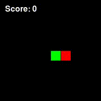
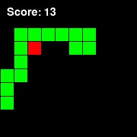

# snake_evolution
Play the classic snake game, or let the snake game play itself. Let an AI control the snake using a neural net, and train it using a genetic algorithm. Visualize how the ai-controlled snake behaves by itself.




## Table of Contents

- [Introduction](#introduction)
- [Features](#features)
- [Requirements](#requirements)
- [Installation](#installation)
- [Usage](#usage)
- [Genetic Algorithm](#genetic-algorithm)
- [Results and Conclusion](#results-and-conclusion)
- [Contributing](#contributing)
- [License](#license)


## Introduction

The classic arcade snake game allows players to control a snake and make it grow as it eats food. The snake can move around in a square grid, and grows by one block each time it eats food. The score players recieve is the total amount of food eaten.

In this project, this simple game is remade using python. On top of that, a neural network is created which can control the snake by itself, and a genetic algorithm is written that can train this neural network to become better and better over time.




## Features

- Classic Snake game implementation.
- AI-controlled snake powered by a neural network.
- Genetic algorithm to optimize the AI's behavior.
- Fitness evaluation based on score, survival time, and efficiency of movements.
- Customizable design parameters for the neural network and genetic algorithm.
- Save and analyze results and conclusions from the optimization process.


## Installation

1. Clone the repository:
   ```shell
   git clone https://github.com/dborstlap/snake-genetic-algorithm.git
   ```

2. Navigate to the project directory:
   ```shell
   cd snake-genetic-algorithm
   ```

3. Install the required dependencies:
   ```shell
   pip install -r requirements.txt
   ```


## Usage

To run the genetic algorithm, save the data and visualize the results, run the main script.
   ```shell
   python main.py
   ```

If you just want to play the snake game manually, run snake_game.py and first set variable manual_control=True, ai_control=False.
   ```shell
   python snake_game.py
   ```

Follow the on-screen instructions to play or observe the AI-controlled snake. Use the arrow keys to control the snake manually when playing.


## Genetic Algorithm

The genetic algorithm is a key component of this project, driving the optimization of the AI-controlled snake's behavior. It operates as follows:

1. Initialization: The algorithm starts by generating an initial population of AI-controlled snakes with random neural network parameters.

2. Evaluation: Each snake in the population plays the Snake game, and its fitness is evaluated based on score, survival time, and efficiency of movements.

3. Selection: Snakes with higher fitness scores have a higher chance of being selected as parents for the next generation. The selection process can use various techniques such as roulette wheel selection or tournament selection.

4. Crossover: The selected parent snakes undergo crossover, which involves combining their neural network parameters to create new offspring snakes.

5. Mutation: To introduce genetic diversity and avoid getting stuck in local optima, the offspring snakes undergo random mutations in their neural network parameters.

6. Next Generation: The new offspring snakes form the next generation, replacing the previous population.

7. Repeat: Steps 2 to 6 are repeated for a specified number of generations.


## Results and Conclusion
The results and conclusion of the genetic algorithm's optimization process can be saved and analyzed. The project provides functionality to store important data, such as the best snake's neural network parameters, fitness scores, and generation-wise statistics. These results can be used to evaluate the performance and effectiveness of the genetic algorithm in improving the AI-controlled snake's gameplay.

To view the saved data and analysis, refer to the results directory. Detailed conclusions and insights can be found in the report.


